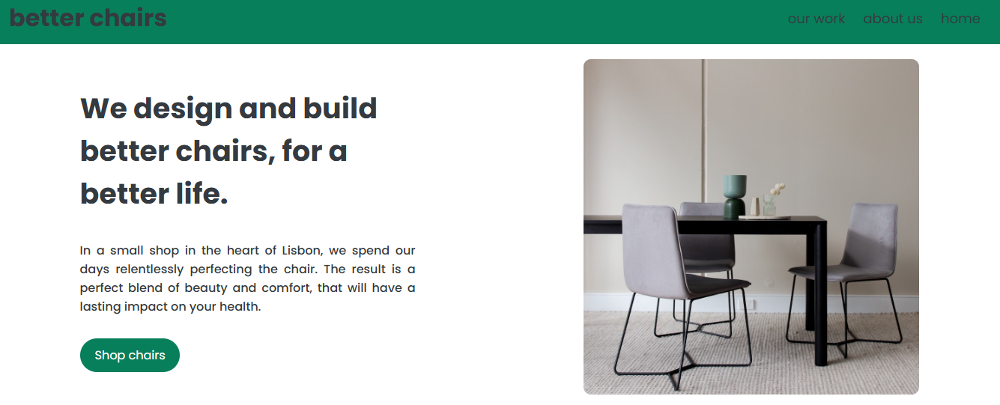

# Lisbon Chair Shop 🪑

A simple and stylish furniture shop website showcasing chairs, built using modern frontend technologies.

## 🚀 Features
- Responsive design for all devices
- Clean and minimal UI
- Easy navigation

## 🛠️ Tech Stack
- **HTML** & **CSS** (with Flexbox & Grid)
- **Sass** for styling
- **JavaScript** (if applicable)

## 📦 Installation & Usage
1. Clone the repository:
   ```bash
   git clone https://github.com/whosfatima/Lisbon-Chair-Shop.git
   ```
2. Open the `index.html` file in your browser.

## 📸 Preview
[Live Demo](https://whosfatima.github.io/Lisbon-Chair-Shop/)  



## 🤝 Contribution
Feel free to fork and improve the project. Pull requests are welcome!

## 📜 License
This project is licensed under the MIT License.
